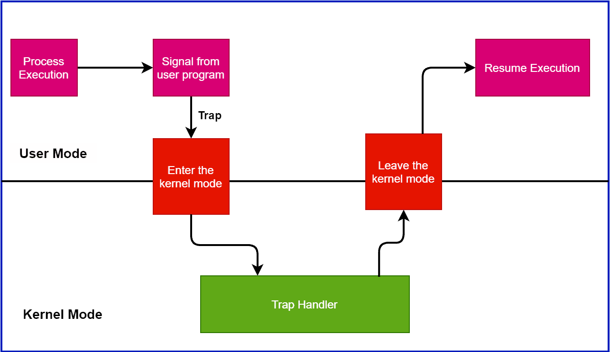

## CPU and Process Execution Mechanisms**

### **1. Mechanism of Process Execution**

#### **Process Creation**

When a new process is created, the operating system allocates memory space for the process's code, data, heap, and stack segments. The code segment contains the executable instructions, the data segment holds global variables, the heap is used for dynamic memory allocation, and the stack manages function calls and local variables. The OS initializes the program counter (PC) to point to the entry point of the program, typically the `main` function in high-level languages. It also sets up a process control block (PCB), which stores essential information about the process, such as its state, priority, and resource allocations. Once the setup is complete, the process is ready to be scheduled for execution on the CPU.

#### **Function Calls**

During execution, when a function is called, the program counter is updated to point to the function's entry point. A new stack frame is created on the process's stack, containing the function's parameters, local variables, and the return address. This mechanism allows for nested function calls and recursive operations. Upon completion of the function, the stack frame is popped, the local variables are discarded, and control returns to the calling function using the saved return address.

#### **System Calls**

System calls provide an interface between user applications and the operating system kernel. When a program needs to perform a privileged operation—such as file I/O, network communication, or process management—it makes a system call. This triggers a software interrupt or trap that switches the CPU from user mode to kernel mode, allowing the OS to execute the requested operation securely. The system call mechanism ensures that user processes cannot directly access critical system resources, maintaining system stability and security.

### **2. CPU Virtualization via Limited Direct Execution**

Modern operating systems employ CPU virtualization to allow multiple processes to share the CPU efficiently. The primary technique used is called Limited Direct Execution (LDE), where user processes are allowed to execute directly on the CPU to minimize overhead, but with restrictions to maintain control.

#### **Direct Execution Protocol**

Under LDE, when starting a process, the OS performs the following steps:

1. **Process Setup:** Allocates memory and initializes the process control block.
2. **Program Loading:** Loads the executable code into memory.
3. **Initialization:** Sets up the stack and heap, initializes registers, and sets the program counter.
4. **Transfer of Control:** The CPU begins executing the process's instructions directly.

However, to prevent processes from performing unauthorized operations, the CPU operates in different modes: user mode and kernel mode. In user mode, certain instructions are restricted. If a process needs to perform a privileged operation, it must request the OS to do so via a system call.

### **3. Handling System Calls**

System calls are critical for process interaction with hardware and system resources.

#### **Trap Mechanism**

    

When a system call is invoked:

1. **Trap Instruction:** The process executes a special instruction (e.g., `INT` in x86 architectures) that triggers a software interrupt.
2. **Mode Switch:** The CPU switches from user mode to kernel mode.
3. **Context Saving:** The OS saves the current state of the process (registers, program counter) onto the kernel stack.
4. **System Call Handler:** The OS executes the appropriate system call handler based on the system call number.
5. **Operation Execution:** The requested operation is performed securely.
6. **Context Restoration:** The OS restores the process's state.
7. **Mode Switch Back:** The CPU switches back to user mode, and the process resumes execution.

This mechanism ensures that user processes cannot compromise system integrity while still providing necessary functionality.

### **4. Process Context Switching**

#### **Context Switch**

A context switch occurs when the CPU switches from executing one process to another. This can happen due to various reasons, such as a process yielding the CPU, waiting for I/O, or the scheduler deciding to preempt the current process in favor of another.

During a context switch, the OS performs:

1. **Saving State:** The state of the current process (registers, program counter, stack pointer) is saved in its PCB.
2. **Scheduler Invocation:** The OS scheduler selects the next process to run based on scheduling algorithms (e.g., Round Robin, Priority Scheduling).
3. **Loading State:** The state of the new process is loaded from its PCB.
4. **Resume Execution:** The CPU begins executing the new process.

#### **Timer Interrupts**

To facilitate preemptive multitasking, the OS uses hardware timers that generate interrupts at regular intervals. When a timer interrupt occurs:

1. **Interrupt Handling:** The CPU suspends the current process and transfers control to the OS interrupt handler.
2. **Context Saving:** The OS saves the process's state.
3. **Scheduling Decision:** The OS may decide to perform a context switch based on scheduling policies.
4. **Reset Timer:** The timer is reset for the next interval.
5. **Resume or Switch:** The OS resumes the same process or switches to another process.

This mechanism ensures that no single process can monopolize the CPU.

### **5. Mechanism of Process Scheduling**

#### **Preemptive vs. Non-Preemptive Scheduling**

- **Preemptive Scheduling:** The OS can interrupt and switch out a running process before it finishes its CPU burst or becomes blocked. This is essential for responsive multitasking systems. Common algorithms include Round Robin, where each process gets a fixed time slice.

- **Non-Preemptive Scheduling:** The OS waits for the running process to terminate or become blocked before scheduling another process. This approach is simpler but can lead to poor responsiveness if a process takes a long time to yield the CPU.

Scheduling algorithms aim to optimize various performance metrics like CPU utilization, throughput, turnaround time, waiting time, and response time.

### **6. System Protection and Control**

#### **User Mode and Kernel Mode**

The CPU operates in two modes to protect system resources:

- **User Mode:** Restricted mode in which user applications run. Direct access to hardware and critical instructions is disallowed.
- **Kernel Mode:** Privileged mode where the OS kernel runs. It has unrestricted access to all hardware and can execute any CPU instruction.

This dual-mode operation prevents user processes from inadvertently or maliciously damaging system integrity.

#### **Trap Tables**

At system boot time, the OS initializes trap tables, which are data structures mapping interrupts and exceptions to their corresponding handler routines. When an interrupt or exception occurs, the CPU consults the trap table to determine the appropriate handler to execute. This mechanism is essential for handling system calls, hardware interrupts, and exceptions like divide-by-zero errors.

### **7. Challenges in CPU Virtualization**

Balancing performance and control is the main challenge in CPU virtualization. The OS must:

- **Ensure Efficiency:** Minimize the overhead of context switches and mode transitions to maintain high system performance.
- **Maintain Control:** Prevent processes from accessing restricted resources or monopolizing the CPU.
- **Provide Security:** Protect against malicious processes that attempt to exploit system vulnerabilities.
- **Handle Hardware Limitations:** Different hardware architectures offer varying levels of support for virtualization and protection mechanisms.

### **8. Additional Considerations**

#### **Concurrency Issues**

In multiprocessor or multicore systems, concurrency adds complexity to process execution and CPU virtualization. The OS must manage:

- **Synchronization:** Use locks, semaphores, or other synchronization primitives to prevent race conditions and ensure data consistency.
- **Deadlocks:** Implement strategies to prevent, avoid, or detect deadlocks where processes are waiting indefinitely for resources held by each other.
- **Interrupt Handling:** Coordinate interrupt handling across multiple CPUs to ensure that interrupts are processed efficiently without conflicts.

#### **Memory Management**

Efficient memory management is crucial for process execution:

- **Virtual Memory:** Allows processes to use more memory than physically available by paging or swapping memory to disk.
- **Memory Protection:** Ensures that processes cannot access each other's memory spaces, providing isolation and security.
- **Allocation Strategies:** The OS uses strategies like paging, segmentation, or hybrid approaches to manage memory allocation.
