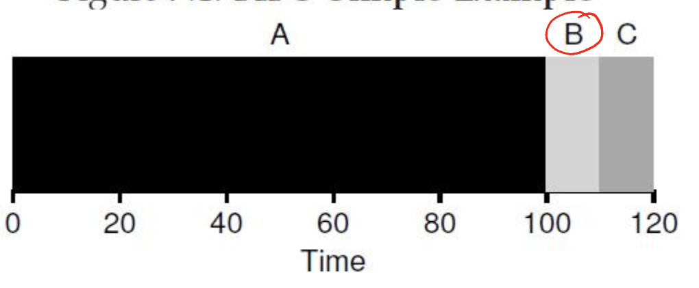
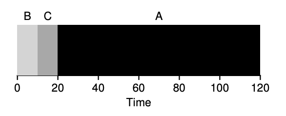
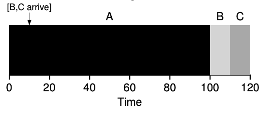
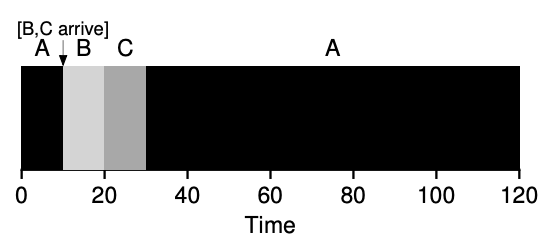
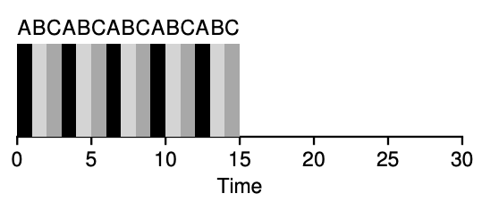

### CPU Scheduling Policies

The concept of CPU scheduling is one of the most important concepts in the operating system. CPU scheduling enables different processes to share the same CPU; it determines the order in which the CPU executes the processes. Efficient CPU scheduling enhances many performance metrics, including CPU utilization, throughput, turnaround time, response time, and fairness.

### 1. Overview of Scheduling Policies

#### 1.1 First-In-First-Out

First-In-First-Out, or First-Come, First-Served, simply schedules the processes in the order they arrive. A process continues to run until it completes before the beginning of the next process.

**Pros:**
- Easy to implement.

**Cons:**
- Susceptible to "convoy effect," wherein a short process gets behind long processes thus yielding high average turnaround time.

    

**Example:**
- Assume there are three processes A, B and C which arrives at the same time. Process A requires 100ms whereas B and C requires 10ms each. B and C will have to wait until the process A terminates hence, increasing their turnaround time.

#### 1.2 Shortest Job First (SJF)
SJF always chooses the process with the shortest execution time. It is a nonpreemptive scheduling algorithm; once a process has been started, it runs to completion.

**Pros:**
- Ensures minimum average waiting time for jobs arriving together.

**Cons:**
- Shorter processes will be waiting behind longer ones if the scheduler is unable to preempt.
- In practice, knowing the process burst times usually is impracticable.

    

    

**Example:**
In the system where A, B and C have the burst times of 100ms, 10ms, and 10ms, SJF will schedule B and C before A. That will decrease the average time from start to finish .

#### 1.3 Shortest Time-to-Completion First (STCF)
Another name is Shortest Remaining Time First (SRTF). STCF is the preemptive version of SJF. If there is a new arrival of the process and its remaining time is less than the current process's, STCF preempts the current process.

**Advantages:**
- Best for reducing average turn around time when all the processes arrive at different times.
**Drawbacks:**
- Needs to know the exact remaining time, which is not possible practically.

**Example:**
- Suppose that A enters at 0 ms and has a burst period of 100 ms. B and C enter after 10 ms each with burst time 10 ms; STCF will preempt A and shall allow B and C to finish so that on an average, turnaround time reduces .

    

#### 1.4 Round Robin (RR)
In Round Robin scheduling, each process will be assigned a fixed time quantum. If a process fails to finish its execution in its given quantum, then it will be preempted and sent to the rear for its next turn.

**Advantages:**

• Suitable for time-sharing systems. It ensures responsive performance for interactive users

**Disadvantages:**

• High Turnaround Time for a process with short burst times because of more frequent context switching.

    

**Example:**
- For three processes A, B, and C all requiring 5 seconds, and given a time quantum of 1 second, RR will cycle through A, B, and C continuously, yielding an average response time of 1 second but stretching overall turnaround.

#### 1.5 Multi-Level Feedback Queue (MLFQ)
MLFQ changes the priority of the processes dynamically based on their behavior. It uses multiple queues for different priority levels and time quantums.

**Basic Rules:**
1. If a process uses up its time slice in a queue, it moves down to a lower-priority queue.
2. Processes that come out of the CPU before their time slice expires-for instance, due to an I/O request-maintain their priority.

**Advantages:**
- It combines the merits of SJF and RR; good interactive responses and CPU-bound processes still have good efficiency.

**Limitations:**
- Parameters such as time slice length, number of queues, and rules for priority adjustment are sensitive to tuning.

**Example:**
- If an interactive job and a long-running job arrive, the interactive job is given a high priority that ensures quick response while, as the long job moves down in priority, it prevents starvation of interactive tasks.

### 2. Scheduling Metrics

#### 2.1 Turnaround Time:
The total time taken for a process from arrival to completion. Lower turnaround time is generally desirable.

#### 2.2 Response Time:
The time between the arrival of a process and its first scheduling. This is an important performance measure for interactive systems where quick responses to user inputs are expected.

#### 2.3 CPU Utilization:
The percentage of time the CPU spends in the actual execution of processes. The higher the CPU utilization, the better the system performance.

#### 2.4 Fairness:
Each process gets a fair share of the CPU. No single process is starved of CPU.

### 3. MLFQ Implementation in Real Systems
In practice, wherever applicable, MLFQ is widely used-for instance, in Linux and BSD variants. It dynamically changes the priorities of the processes according to the characteristics of the workload that is observed and therefore adapts to workload types.

- **Linux MLFQ:**
 • Multiple levels of priority exist, whereby a newly created process is inserted in high-priority queues.
 • CPU-bound processes are slowly demoted into lower priority queues, whereas interactive tasks remain in high-order priority queues.

- **Solaris Time-Sharing Scheduler:**
 • Can be tuned via priority tables, which enable fine-grain adjustment of scheduling behavior depending on different queues.
