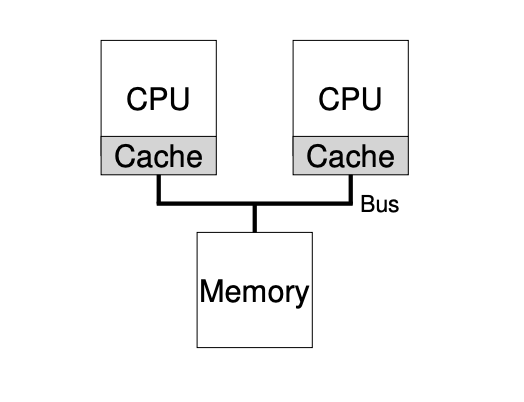
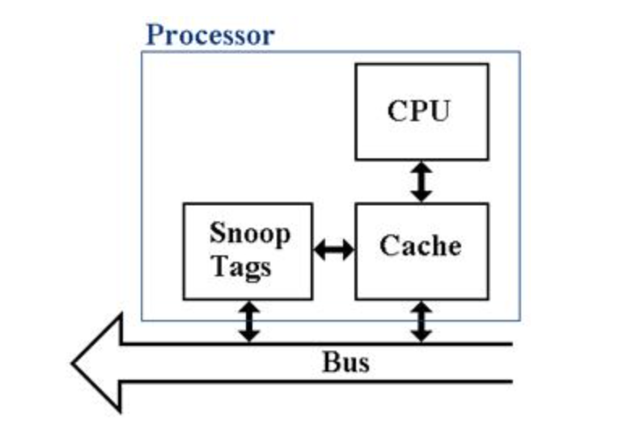

# Multiprocessor Scheduling (Advanced)

## **Challenges of Multiprocessor Scheduling**

- **Parallelism & Application Support:**
Single-threaded applications cannot exploit multiple CPUs, and hence, programmers must write parallel programs  in order to exploit multiple CPUs.

- **Multiprocessor Scheduling Problem:** 
The OS must decide what jobs should run on what CPU. There are a number of challenges here including how to deal with cache coherence, synchronization, and load balance.

## **Background: Multiprocessor Architecture**

- **Cache Coherence:**
In multi-processor systems, for example, each processor has usually a local cache. When one processor modifies its cache data without making the changes available to the other processors, inconsistencies arise because of a problem in cache coherence. To do so, the hardware implements such **bus snooping** that makes CPUs constantly snoop the memory accesses of others, by invalidating or updating relevant cache entries.

    

    

- **Synchronization:**
Even with cache coherence protocols, programs with shared data require the use of synchronization mechanisms such as locks to prevent various types of problems, including double-free error or race conditions due to concurrent updates.

## **Main Challenges of Multiprocessor Scheduling**

1. **Cache Affinity:**
It is preferable that if a process executes repeatedly, it should be run on the same CPU, as the CPU's cache may still contain this process-used data; hence, memory access time is reduced. Neglecting cache affinity results in degraded performance by forcing the reloading of the cache very frequently.

2. **Single-Queue Multi-Processor Scheduling (SQMS):**
- All jobs go into one queue and multiple CPUs pull their jobs from this shared queue.
 - The obvious problem with this simple approach is **scalability due to lock contention**, and it also can't maintain cache affinity since jobs may be shifted between processors, which leads to a lot of cache misses.
  
## **Multi-Queue Multiprocessor Scheduling (MQMS)**

To overcome the inefficiencies in SQMS, most of the systems implement MQMS, wherein each CPU maintains its scheduling queue. Salient features of MQMS are as follows:

• **Scalability:**
  The increase in CPUs allows each CPU to function independently without suffering from synchronization bottlenecks as in SQMS.
• **Cache Affinity:**
  As each CPU tends to continue processing the same set of jobs, cache affinity is naturally maintained.

However, MQMS brings in a **load imbalance problem** whereby some CPUs sit idle with less number of jobs while others are overloaded.

## **Load Balancing and Migration**

To handle load imbalance, the concept of **job migration** is employed. It migrates jobs from overloaded CPUs to idle ones. On the other hand, job migration causes some overhead. When and how frequently job migration needs to be carried out is quite tricky to decide. Work-stealing algorithms are utilized wherein an underloaded CPU checks other CPUs for work overload and "steals" jobs to balance its workload.

## **Linux Multiprocessor Schedulers**

In Linux, multiprocessor scheduling has evolved through several sophisticated algorithms to effectively manage the challenges posed by multi-core systems. Over time, three prominent schedulers have emerged: the **O(1) Scheduler**, the **Completely Fair Scheduler (CFS)**, and the **Brain F*** Scheduler (BFS)**. 

- **O(1) Scheduler**: This scheduler, widely used in earlier Linux versions, operates with a constant time complexity for scheduling decisions. It employs multiple queues and is **priority-based**, adjusting process priorities dynamically to balance interactivity and throughput. The O(1) scheduler is efficient for handling large numbers of processes but suffers in scenarios with many CPUs due to issues with scalability and contention in handling locks.

- **Completely Fair Scheduler (CFS)**: Introduced as the default scheduler in modern Linux kernels, CFS aims to allocate CPU time proportionally among tasks based on their assigned weight. It follows a **proportional-share model**, ensuring that processes get CPU time in a manner similar to the ideal "perfect multitasking" scenario. CFS's design inherently supports multiprocessor systems by using **per-CPU run queues**, which helps maintain cache affinity and reduces the likelihood of lock contention.

- **Brain F*** Scheduler (BFS)**: BFS, a simpler yet radical approach, is a **single-queue scheduler** that focuses on providing low latency and responsiveness for desktop systems, favoring simplicity over scalability. BFS uses the **Earliest Eligible Virtual Deadline First (EEVDF)** algorithm, aiming to ensure that tasks with higher priority and real-time requirements are served promptly. While BFS works well for systems with fewer CPUs, it may struggle with scalability in environments with a high number of processors.

Each of these schedulers targets different use cases, ranging from server environments requiring scalability to desktop systems prioritizing responsiveness. They highlight the trade-offs between complexity, efficiency, and performance when designing a multiprocessor scheduler in Linux.