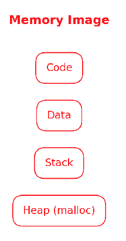
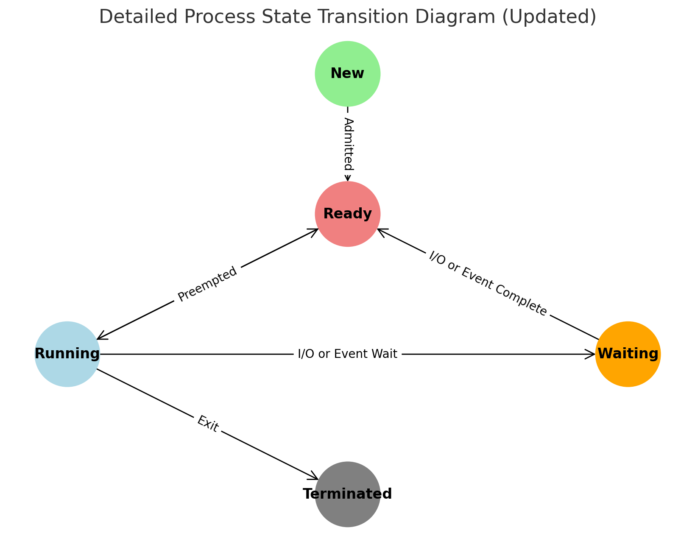

### Process Abstraction

A **process** is a fundamental concept in any operating system (OS). It refers to a program in execution. A process is more than just the program code. It includes everything the program needs to execute properly: memory, CPU registers, and access to resources like files. This abstraction allows the OS to manage and execute multiple programs efficiently while maintaining isolation between them.

#### What is a Process?

When a program is sitting on the disk, it is just a collection of instructions and data. However, when the OS loads it into memory and begins execution, it transforms into a process. A process is, therefore, a **running instance of a program**.

Here are the key components that make up a process:

1. **Program Code (Text Segment)**: The actual instructions to be executed by the CPU.
2. **Data Segment**: This includes both static data (constants and global variables) and dynamic data (heap memory used for dynamic allocation).
3. **Stack**: A region of memory that stores local variables, function parameters, and return addresses.
4. **Heap**: Dynamic memory allocated at runtime for data structures like linked lists, trees, etc.
5. **CPU Context**: This includes the **program counter (PC)**, which holds the address of the next instruction to execute, and other CPU registers like the **stack pointer** (SP) and **general-purpose registers**.

    

Processes also include information like file descriptors (pointers to open files), network connections, and the current state of execution. This information is stored in a special data structure called the **Process Control Block (PCB)**.

#### OS’s Role in Creating and Managing Processes

The operating system is responsible for creating and managing processes. It provides mechanisms and policies to handle various aspects of process management. Here is a step-by-step breakdown of what happens when a process is created:

1. **Loading the Program**: The OS first allocates memory for the process and loads the program code and static data from disk into memory. It also sets up the **stack** and **heap** for the process.
2. **Setting Up CPU Registers**: The OS initializes the CPU registers, including the **program counter** (which points to the first instruction of the program) and the **stack pointer** (which points to the top of the stack). This allows the process to start executing.
3. **Opening Standard Files**: The OS opens standard files like **stdin**, **stdout**, and **stderr**, which allow the process to receive input from the user, display output, and handle error messages.
4. **Starting Execution**: Finally, the OS starts the execution of the process by handing control over to the CPU. From this point, the CPU begins executing the instructions of the program.

The OS uses **context switching** to efficiently manage multiple processes. A context switch occurs when the OS pauses one process and resumes another, saving the state of the paused process in its PCB.

#### Process States

A process can exist in various states during its lifetime. These states are:

1. **New**: The process is being created and has not yet started executing.
2. **Running**: The process is currently executing on the CPU.
3. **Ready**: The process is ready to execute but is waiting for the CPU to become available.
4. **Blocked**: The process is waiting for some event to occur, such as data to be read from a disk or a network request to complete. It cannot execute until this event occurs.
5. **Terminated (Dead)**: The process has finished executing and is no longer active.

    

The transitions between these states are managed by the OS’s **scheduler** and **interrupt handling system**. For example, when a process requests data from a disk, it transitions from the running state to the blocked state. Once the data is available, the OS unblocks the process, moving it to the ready state.

#### Special Process Types: Zombie and Orphan Processes

1. **Zombie Processes** :

* A **zombie process** is a process that has finished execution but still has an entry in the process table. This happens because the parent process has not yet read the exit status of the child process.
* When a process completes, it sends an exit status to its parent process. The parent must call the `wait()` system call to read this exit status and clean up the process entry in the process table.
* If the parent doesn’t do this, the process remains in a "terminated" state but still occupies space in the process table, making it a zombie.
* **Why It’s a Problem** : If too many zombie processes accumulate, they can exhaust the process table, preventing the creation of new processes. However, zombies are usually harmless since they do not consume system resources like CPU or memory.

1. **Orphan Processes** :

* An **orphan process** is a process whose parent has terminated or exited without waiting for the child to finish execution. In this case, the orphan process is "adopted" by the **init process** (process ID 1), which becomes its new parent.
* The `init` process is responsible for cleaning up orphan processes once they finish execution.
* **Why It’s Managed** : Orphan processes are automatically reparented by the OS to ensure they don’t become zombies. The `init` process ensures proper termination of these processes and prevents resource leaks.

#### How the OS Virtualizes the CPU

Since modern computers usually have only a few physical CPUs but need to run many processes, the OS creates the illusion that each process has its own CPU. This is done through **time-sharing**. The OS switches between processes so quickly that it seems like they are running at the same time.

The **CPU scheduler** is responsible for choosing which process to run at any given moment. The OS employs different scheduling algorithms to manage this efficiently:

- **First-Come, First-Served (FCFS)**: The first process to request the CPU gets it.
- **Round Robin**: Each process is given a small time slice (e.g., 100 milliseconds) to run. When its time is up, the next process in line gets to run.
- **Priority Scheduling**: Processes are assigned a priority, and the CPU is given to the highest-priority process.

By frequently switching between processes (called **preemption**), the OS provides the illusion of multitasking, where multiple processes seem to run at once, even on a single CPU.

#### Process Creation and Termination

Processes in modern operating systems often create other processes. In UNIX-like systems, this is done through system calls like `fork()` and `exec()`. Here’s how this works:

1. **Fork**: The `fork()` system call creates a new process by duplicating the parent process. The new process is called the **child** process, and it has its own memory and CPU context, but it starts with the same program code as the parent.
2. **Exec**: The `exec()` system call allows a process to replace its own program code with new code, effectively running a new program.
3. **Wait**: The `wait()` system call allows a parent process to wait for a child process to complete its execution.
4. **Exit**: When a process finishes executing, it uses the `exit()` system call to terminate, and the OS cleans up its resources.

#### Process Control Block (PCB)

The **Process Control Block (PCB)** is a crucial data structure maintained by the OS to keep track of each process. The PCB contains:

- **Process ID (PID)**: A unique identifier for the process.
- **Process State**: The current state of the process (running, ready, blocked, etc.).
- **CPU Registers**: The current contents of the CPU registers when the process is not running. This includes the **program counter** and **stack pointer**.
- **Memory Information**: Information about the memory allocated to the process, such as the base and limit of the process’s address space.
- **Open Files**: A list of the files that the process has open.
- **Parent/Child Relationships**: Information about the parent process and any child processes created by this process.

When a context switch occurs, the OS saves the process’s state in its PCB and loads the state of the next process from its PCB. This allows the OS to pause and resume processes as needed.

#### Scheduling Policies and Mechanisms

In modern systems, scheduling is handled by policies and mechanisms. **Mechanisms** are the low-level methods the OS uses to switch between processes, like context switching. **Policies** decide which process to run at any given time. These policies can vary depending on system goals:

- For interactive systems (like desktops), policies favor low-latency responses to user actions.
- For batch processing systems (like servers), policies favor throughput and efficiency.

---

The **process abstraction** allows operating systems to manage and execute multiple programs efficiently, giving the illusion that each process has its own CPU and memory. By managing memory, scheduling CPU time, and ensuring process isolation, the OS enables multitasking and resource sharing while ensuring security and stability. Understanding how processes are created, scheduled, and managed provides insights into the inner workings of any modern computer system.
